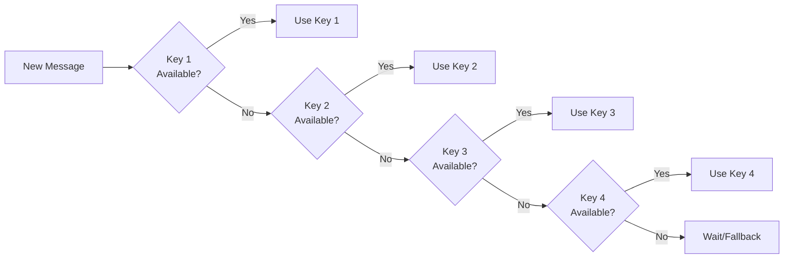

# 🔑 Multi-Key Gemini Setup Guide

## Why Multiple Keys?

With 4 Gemini API keys, you get:
- **4 keys × 20 req/day = 80 requests/day**
- **Automatic rotation** to stay under 5 req/min per key
- **Zero cost** - all completely free!

---

## Getting Your API Keys

Get 4 free Gemini API keys from different Google accounts:

### Method 1: Use Multiple Google Accounts

1. **Account 1**: Go to [Google AI Studio](https://aistudio.google.com/app/apikey)
   - Sign in with your main Google account
   - Create API key → Copy it

2. **Account 2-4**: Repeat with other Google accounts
   - Use family members' accounts (with permission)
   - Or create new Google accounts

### Method 2: Multiple Projects (Same Account)

1. Go to [Google AI Studio](https://aistudio.google.com/app/apikey)
2. Click **"Create API key in new project"** 4 times
3. Each project gets its own separate rate limits!

---

## Configuration

### Your `.env` file should look like:

```bash
# Paste your 4 API keys here (comma-separated, no spaces after commas)
GEMINI_API_KEYS=AIzaSyA...,AIzaSyB...,AIzaSyC...,AIzaSyD...

# Which models to use for each key
GEMINI_MODELS=gemini-2.0-flash-exp,gemini-1.5-flash,gemini-1.5-flash,gemini-1.5-flash

# Rate limits (default: 20/day, 5/min per key)
GEMINI_DAILY_LIMIT=20
GEMINI_MINUTE_LIMIT=5
```

### Model Options

| Model | Speed | Quality | Free Tier |
|-------|-------|---------|-----------|
| `gemini-2.0-flash-exp` | ⚡ Fastest | 🌟 Latest | ✅ Yes |
| `gemini-1.5-flash` | ⚡ Fast | ⭐ Good | ✅ Yes |
| `gemini-1.5-pro` | 🐢 Slower | ⭐⭐⭐ Best | ✅ Yes (lower limits) |

**Recommendation**: Use `gemini-2.0-flash-exp` for all keys for the best speed/quality balance.

---

## How Rotation Works



**The bot automatically:**
1. Checks if current key can be used (under limits)
2. If not, rotates to the next key
3. Records usage to stay under 5/min and 20/day per key
4. Usage resets daily and every minute

---

## Monitoring Usage

When running, you'll see logs like:

```
🤖 Using AI provider: GEMINI
📊 gemini-0 (gemini-2.0-flash-exp): 3/5 req/min, 15/20 req/day
```

This shows:
- Which key is being used (`gemini-0` = first key)
- Current usage vs limits

---

## Rate Limit Storage

Usage is tracked in `data/rate-limits.json`:

```json
{
  "gemini-0": {
    "requestsToday": 15,
    "requestsThisMinute": 3,
    "lastResetDay": "2026-01-19",
    "lastResetMinute": 123456
  }
}
```

This persists across restarts, so you won't accidentally exceed limits!

---

## Testing Your Setup

1. **Add all 4 keys** to `.env`
2. **Restart the bot** (Ctrl+C, then `npm run dev`)
3. **Send test messages** and watch the rotation in console
4. You should see the bot cycling through: `gemini-0`, `gemini-1`, `gemini-2`, `gemini-3`

---

## Expected Capacity

With 4 keys at 20 req/day each:

| Messages/Day | Status |
|--------------|--------|
| 1-50 | ✅ No problem |
| 50-80 | ✅ Totally fine |
| 80-100 | ⚠️ Hitting limits, some may queue |
| 100+ | ❌ Need more keys or paid providers |

For normal personal use (10-30 messages/day), 4 keys is **more than enough**!
